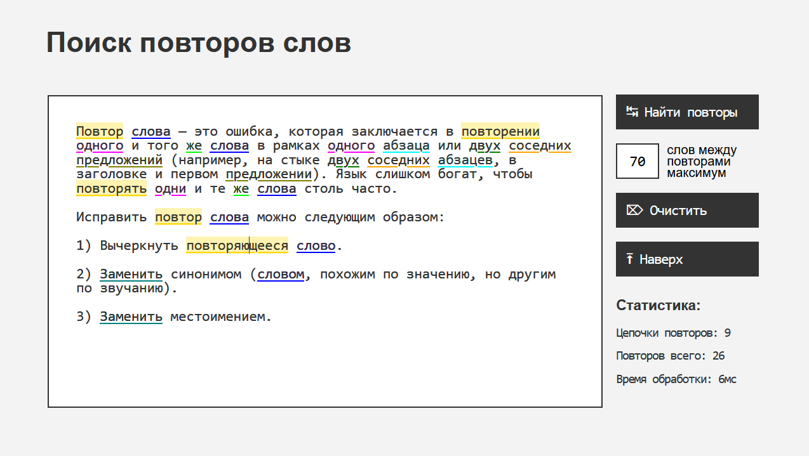

# Поиск повторов слов / Repeated Words Finder for Russian

## Поиск повторов однокоренных слов в текстах на русском языке

Ссылка на рабочую версию: https://sapomaro.github.io/repeatedwords

---

## Функционал:
- производит все вычисления локально на клиенте без отправки каких-либо данных на сервер (можно скачать собранный файл с приложением *index.html* из папки */dist* и пользоваться им на своём ПК без интернета);
- находит слова любых частей речи с учетом приставок/суффиксов;
- выделяет цепочки повторов разными цветами, чтобы их было легче различать; при нажатии подсвечивает текущую;
- можно самостоятельно задавать расстояние между потенциальными повторами, чтобы регулировать чувствительность поиска.

Алгоритм поиска постоянно улучшается. В некоторых случаях подсвечиваются слова, которые нельзя считать повторами, – я вручную заношу их в список исключений.

---

## Стек технологий / Technology stack

JavaScript ES5 & HTML4, legacy-friendly, zero dependency, no backend, self-written tests
